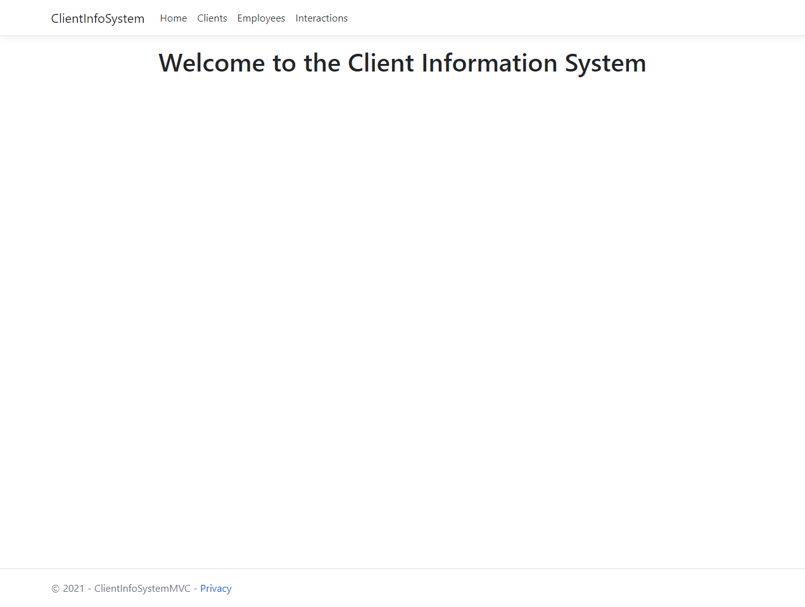
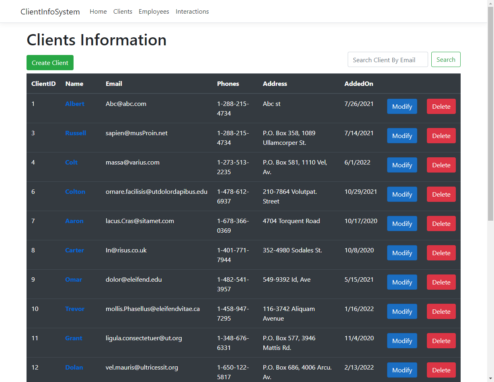
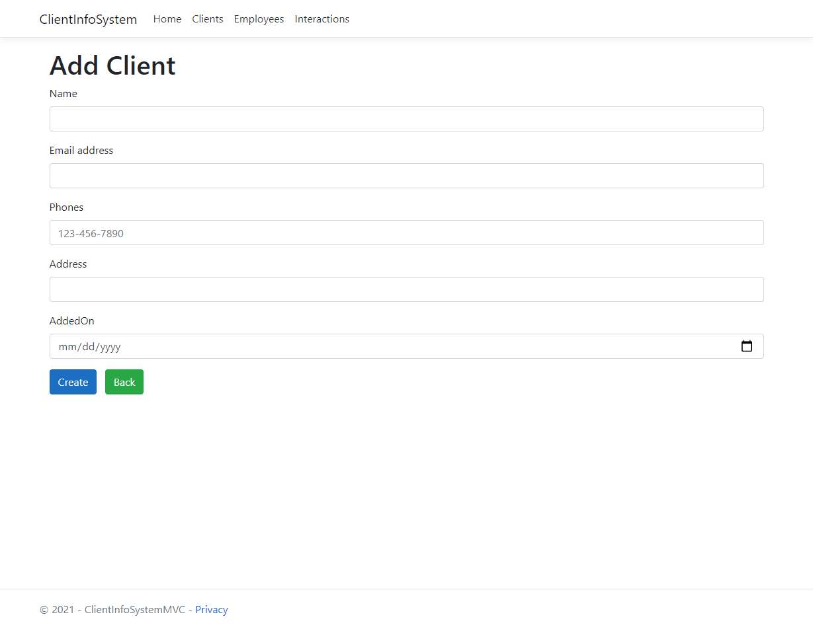
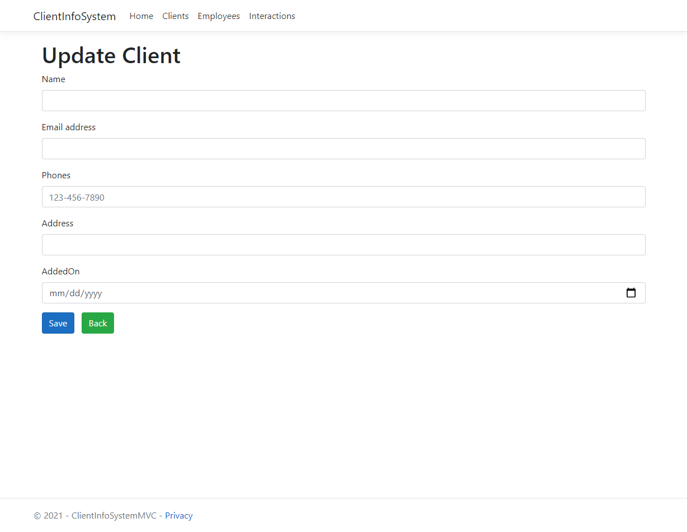
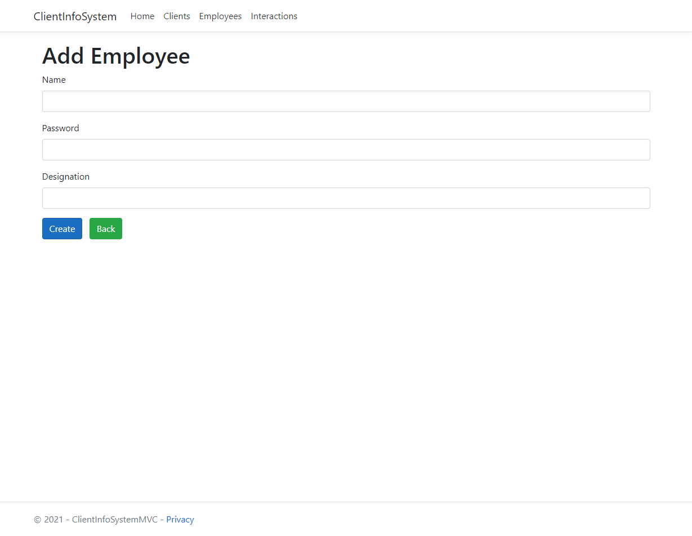
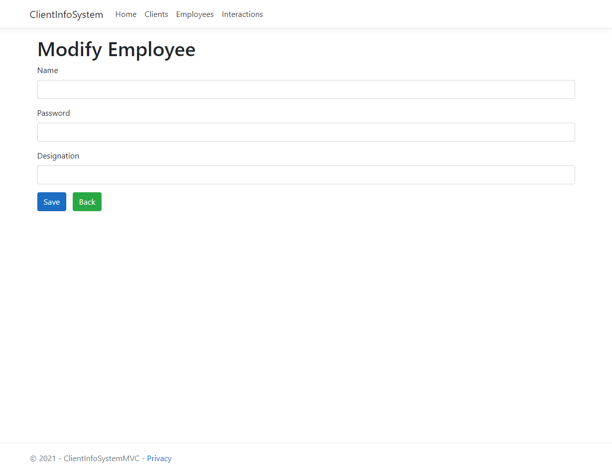
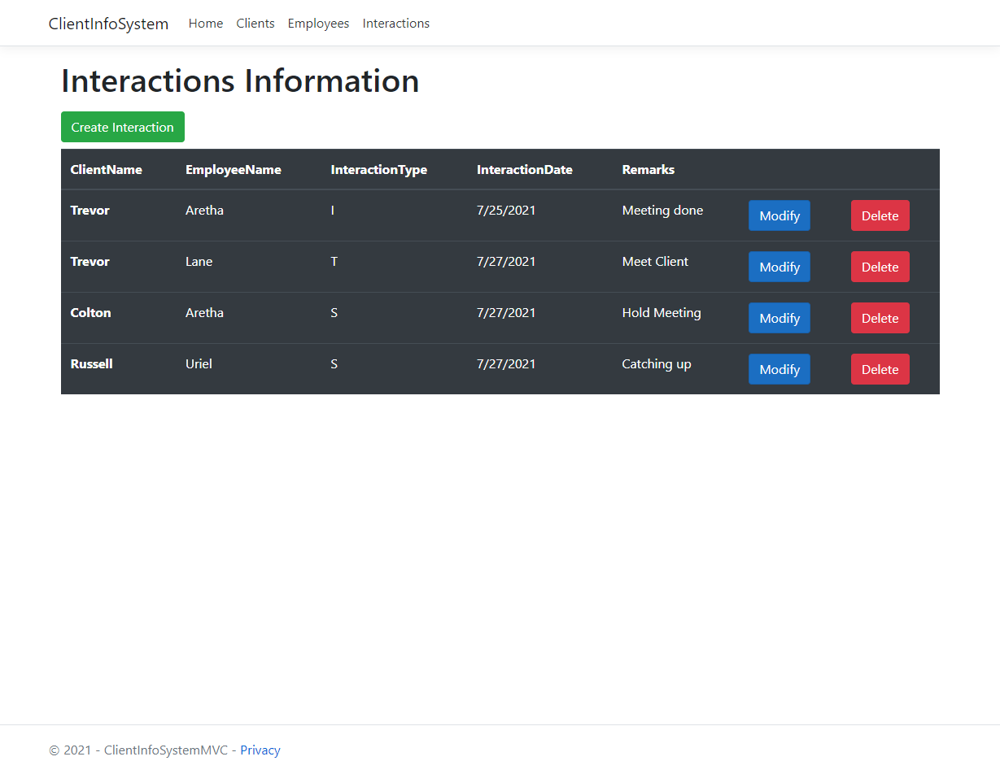
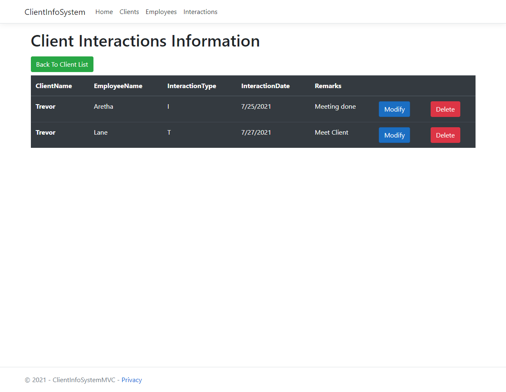

# Client Information System

Built using full-stack knowledge, an application which can store information about clients and the interactions between employees and clients. This application develop with technologies .Net Core Web API, Entity Framework Core, SQL Server Database.

## Tech Stack

All functionality in this project was built primarily with ASP.Net Core, Entity Framework and SQL Server database.

## User Stories

- As a User, I should be able to view dashboard in main page.
 
  
  
- As a User, I should be able to view all the clients.

  
  
- As a User, I should be able to create/modify/delete the clients.
  
  
  

- As a User, I should be able to create/modify/delete the employees.

  
  
  
- As a User, I should be able to browse all employees list, and have it connected to the clients with interactions.

  
  
  

